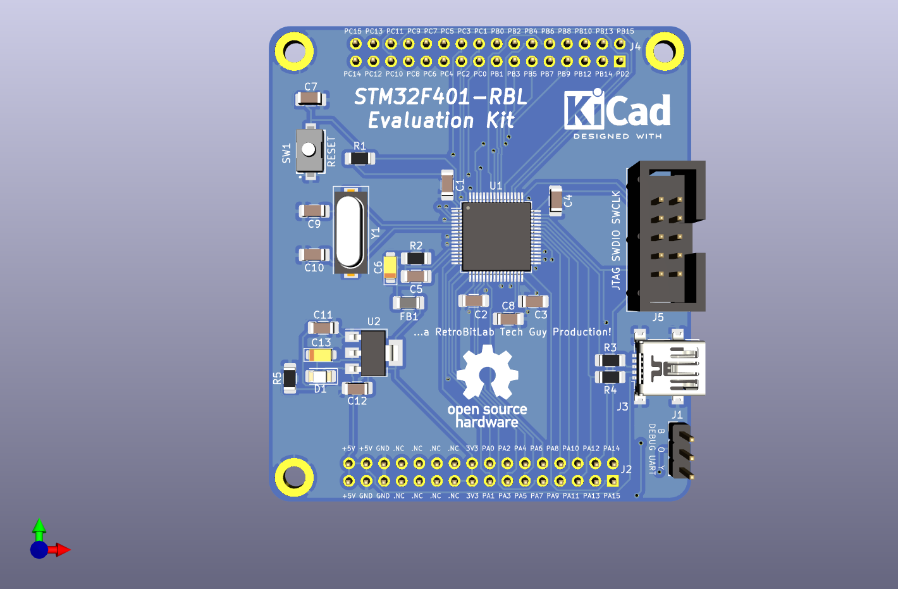
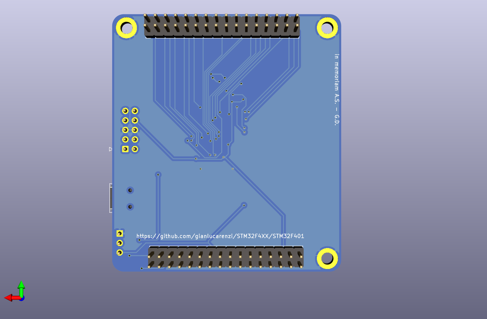
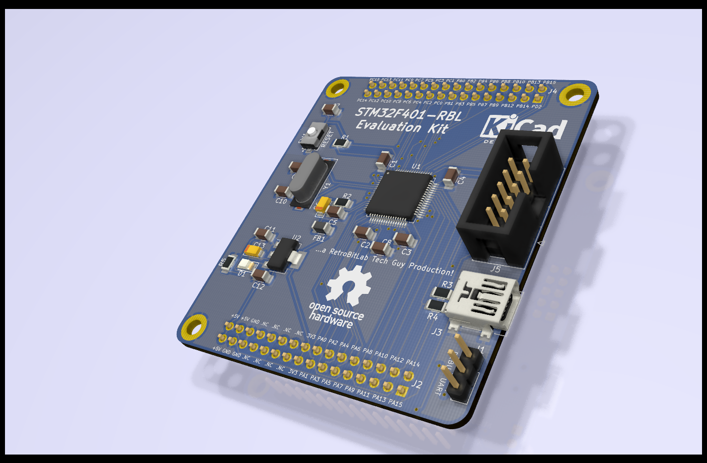

# STM32F401 Generic Module

A generic development board for the STM32F401 microcontroller.

## Overview

This project provides a development board for the STM32F401RCT6 microcontroller in a LQFP-64 package. The board is designed to be a standard platform for developing and prototyping applications with this MCU. It includes basic components and connectors to get started quickly.

## Features

*   STM32F401RCT6 microcontroller
*   USB-C connector for power and data
*   SWD connector for programming and debugging
*   Reset button
*   BOOT0 button
*   User LED
*   Power LED
*   Expansion headers for all MCU pins

## Images

**Board Top**

**Board Bottom**

**Board Schematics**

## Hardware

The hardware design is done in KiCad. You can find the project files in this repository.

*   **Schematic:** [STM32F4XX.sch](STM32F4XX.sch)
*   **PCB Layout:** [STM32F4XX.kicad_pcb](STM32F4XX.kicad_pcb)
*   **KiCad Project:** [STM32F4XX.pro](STM32F4XX.pro)
*   **Schematics PDF:** [STM32F401-schematics.pdf](STM32F401-schematics.pdf)

### Manufacturing Files

Gerber and production files for JLCPCB are available in the `production` directory and in the following archives:

*   **Gerbers:** [STM32F401-gerbers.zip](STM32F401-gerbers.zip)
*   **BOM for JLCPCB:** [STM32F4XX-v2.0-JLCPCB-BOM.csv](STM32F4XX-v2.0-JLCPCB-BOM.csv)
*   **CPL for JLCPCB:** [STM32F4XX-v2.0-JLCPCB-CPL.csv](STM32F4XX-v2.0-JLCPCB-CPL.csv)

## Firmware

The firmware for the HID bootloader is located in the `STM32_HID_Bootloader` directory. It is based on the STM32 HAL library.

*   **Bootloader Source Code:** [STM32_HID_Bootloader/](STM32_HID_Bootloader/)

## Getting Started

To get started with this project, you will need:

1.  A text editor or IDE for firmware development (e.g., VSCode with PlatformIO, STM32CubeIDE).
2.  An ST-Link v2 programmer/debugger.
3.  A USB-C cable.

### Building and Flashing

1.  Clone this repository.
2.  Open the `STM32_HID_Bootloader` directory in your IDE.
3.  Build the project.
4.  Connect the ST-Link to the SWD connector on the board.
5.  Flash the firmware to the MCU.

## Contributing

Contributions are welcome! Please feel free to submit a pull request or open an issue if you find any problems or have suggestions for improvements.

## License

This project is licensed under the MIT License. See the [LICENSE](LICENSE) file for details.
